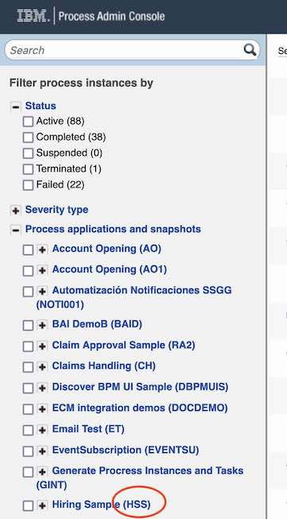
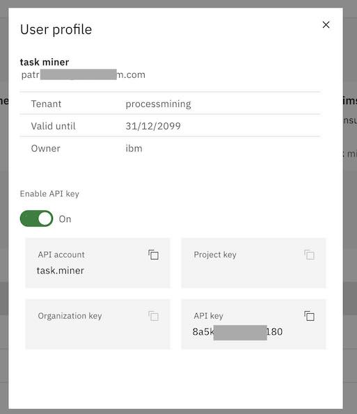

# Accelerator for IBM Business Automation Workflow and IBM Process Mining
## NOTE


## Introduction
This repository is a free contribution provided as-is to easily connect IBM Business Automation Workflow and IBM Process Mining.

When using IBM Process Mining to analyse BAW processes, process owners and analysts get a full objective picture of these processes: activities and transition frequencies, durations, costs, reworks, variants, and deviations. 

Process Mining helps understanding the business reasons that lead to non-optimal processes. Contextual data available in the process events are used to understand the root-causes, to mine the workflow business rules, and to create and monitor business KPIs in intuitive dashboards.

After having discovered the problems and having analyzed the root-causes, the analysts can plan for workflow improvements: automating a manual activity with a RPA bot, automating a business decision with business rules, changing the workflow, and so forth. 

With Process Mining, analysts can create what-if simulation scenarios in order to obtain instantly the ROI, the to-be KPIs.

## Credits
Thanks to Gerry Baird who wrote https://github.com/gerry-baird/grump, from which we reused many functions to retrieve data from BAW with the REST API.

## Important Note

All you need to do is to call the python program with a configuration json file as parameter.

```
python3 BAW_to_IPM.py config/config_myJobName.json
```

Installation: 
```
python3 -m venv myenv
source myenv/bin/activate
pip install -r requirements.txt
pip install requests
```

## How to Use the Accelerator
This is a no-code accelerator that can be used by process owners and analysts who just need to fill-out a form to:
- Connect to the BAW server
- Select the BAW process to mine
- Optionnaly connect to the IPM server to automatically load the event log into a process mining project
- Optionnaly set an loop rate (in seconds) and a paging size to extract data while reducing the RAM needs and the impact on BAW
- Optionnaly set an instance limit to size the extraction.
- Optionnaly exclude some BAW data
- Run several extraction jobs that can be stopped and resumed.

## How to Install the Accelerator
If you are using the Techzone environment for BAW, please see the next section
Prerequisite: Python3 

Get this repository in your local environment

Go to the project directory, create a python virtual environment, activate the environment and install the packages.

```
python3 -m venv myenv
source myenv/bin/activate
pip install -r requirements.txt
pip install requests
```


## How to Run the Accelerator
When running a new shell you need to activate the virtual environment before executing the accelerator script:
```
source myenv/bin/activate
```

The configuration json file specifies the configuration of the extraction (see below).
```
python3 BAW_to_IPM.py config/config_myJobName.json
```

## Configuring the extraction job
The json configuration files and the CSV files are using an extraction job name.
For instance, if the job name is `myJobName`, the configuration file is saved in `config/config_myJobName.json`.<br>
The BAW event logs are saved in `data/BAW_myJobName_<timestamp>.zip` 


## Running an extraction job
Mandatory parameters:
- From date and its criteria (modifiedAfter, createdAfter, closedAfter) retrieve the instances that occur/created/closed after this date.
- To date and its criteria (modifiedBefore, createdBefore, closedBefore) retrieve the instances that occur/created/closed before this date.

Optional parameters:
- Instance filter status: leave empty to retrieve all instances whatever their status, or list the statuses separated by a comma with no
- Paging size requires loop_rate>=0.  Paging fractions the extraction steps in order to save RAM and to reduce impact on BAW. 
- Number of threads increases the speed by splitting the extraction work into several threads. This increase the load on the BAW server too. A good balance needs to be found.
- Instance limit is used for testing only: each extraction stops when the number of instance specified here is reached. This is useful when sizing the time required to get historical data, or the load on the BAW server or on the RAM
- Create a CSV at each loop generates a CSV file at each extraction loop (if events were retrieved). When unchecked, the CSV file is generated when the job is completed, stopped, or when the number of events reaches 500k events (default)

```
python3 BAW_to_IMP.py config/config_myJobName.json
```

## Main extraction scenarios
The configuration directory includes several extraction examples for the main use cases
### Historical Basic
- Loop rate = 0
- instance limit = 0
- paging size = 0
- (optional) number of threads = 5

The job is executed once and ends-up delivering a CSV file.

```CAUTIOUS```: the extraction can be very long. It can decrease the performance BAW and can request a huge RAM.
We recommend to use this only if you know that the extracted volume is reasonable.


### Historical with paging
- Loop rate = 10 sec
- instance_limit = 0
- paging size = 30
- (optional) number of threads = 5
- (optional) generate CSV at each loop = false
- Create CSV at each loop = false

During the first extraction loop, the job fetches all the instances that match the dates. But instead of getting the details of the tasks for each instance in one shot (this is the most consumming task), it get the task details for the first 30 instances, sleeps for 6 seconds, and continue getting the task details for the next 30 instance, and so forth until the instance list is completely processed.

Optionnaly we can generate a CSV file at each loop, and therefore keeping the RAM low. Without checking this option, a CSV file is generated each time we exceed 500k events (default). This threshold can be changed in the configuration file with 'trigger_csv_beyond'

This is the recommended approach for extracting historical data.

### Performance Sizing
- Loop rate = 0
- instance_limit = 100
- (optional) number of threads = 5

The job extracts a maximum of 100 instances as well as the task details. Then it generates the CSV.
You can deduce the time needed to extract all the data and determine the configuration to adopt

## Configuring the accelerator for BAW

You can use the accelerator to fetch the data from BAW and store the resulting CSV file in your local directory. You will then be able to load manually the CSV file into IBM Process Mining. In this case, you only need to have:
- IBM BAW admin login and password
- The process name (application) that you want to mine
- The project name to which the process belongs (acronym)

- You can enter the password in the configuration file. 

The other BAW parameters are optional:

- Modified after: Retrieve process instances modified after the date expressed like this: 2022-06-01T22:07:33Z
- Modified before: Retrieve process instances modified before the date expressed like this: 2022-06-01T22:07:33Z

If you want to add specific process or task variables, you can list them in the "Business data" field of the job config file. Read the BAW data section below for more details

If the IBM Process Mining configuration left empty, the resulting CSV files will be loaded manually in IBM Process Mining.

In BAW, you can find the project name (acronym) in parenthesis besides the process name in <BAW_URL>/ProcessAdmin. 


See a screen shot of the BAW inspector at the bottom of this document

## Extracting the BAW business data
- Include exposed variables: If the process has declared exposed variables, these data can be automatically added to each event. The field name of each tracked data in the resulting CSV file starts with 'trkd'. Ex: trkd.requisition.requester. 

You can add any process or task data into the CSV. In the configuration file, list each data path in an array separated with a comma (,). For example:
`
        "task_data_variables": [
            "requisition.gmApproval",
            "requisition.requester"
        ],
`

The field name for each variable in the resulting CSV file starts with 'tsk'. Ex: tsk.requisition.gmApproval

WARNING: a process mining project can only load CSV file with the same columns. If you add or remove a field during an extraction, you can't load it in an existing process mining project that loaded CSV files with different columns.

You can find these data in BAW process designer.

## Extracting the BAW process data
The configuration file `BAW_default_fields.json` can be modified to change the mapping between the BAW data and the default process mining fields, or to exclude more or less task common data. Copy the default file before modifying it.

You could change the mapping in :
```
  "process_mining_mapping": {
        "process_ID":"piid",
        "task_name":"name",
        "start_date":"startTime",
        "end_date":"completionTime",
        "owner":"owner",
        "team":"teamDisplayName"
    },
```

You could add task data that you don't need in this list, or keeping some by removing them from the list.
```
  "excluded_task_data": [
        "description",
        "clientTypes",
        "containmentContextID",
        "kind",
        "externalActivitySnapshotID",
        "serviceID",
        "serviceSnapshotID",
        "serviceType",
        "flowObjectID",
        "nextTaskId",
        "actions",
        "teamName",
        "teamID",
        "managerTeamName",
        "managerTeamID",
        "displayName",
        "processInstanceName",
        "assignedTo",
        "assignedToID",
        "collaboration",
        "activationTime",
        "lastModificationTime",
        "assignedToDisplayName",
        "closeByUserFullName"
    ]
```

The list of the default data is for reference only, it is not used by the program, but you can select from here data that you want to exclude.
```
    "included_task_data": [
        "activationTime",
        "atRiskTime",
        "completionTime",
        "description",
        "isAtRisk",
        "originator",
        "priority",
        "startTime",
        "state",
        "piid",
        "priorityName",
        "teamDisplayName",
        "managerTeamDisplayName",
        "tkiid",
        "name",
        "status",
        "owner",
        "assignedToDisplayName",
        "assignedToType",
        "dueTime",
        "closeByUser"
    ],
```

## Configuring the accelerator for IBM Process Mining

You can use the accelerator to fetch the data from BAW, and to automatically load the resulting CSV file into IBM Process Mining. The following parameters are required:
- IBM Process Mining
- User ID
- API Key
- Organization ID
- Project key

If the project key exists in the organization, the data is loaded into this project.<br>
If the project key does not exist yet, a new project is created with the same name.
Note= project keys can't include blank spaces. Use names like 'hiring-process'

In the IBM Process Mining User Profile, make sure you have API key enabled, and copy the API account and the API key.

See a screen shot of the Process Mining screen at the bottom of this document


## Configuration file
Instead of using the web server to configure an extraction job, you can create an edit configuration files. The configuration below results from the parameters entered with the Web UI.
Note how the BAW business data are implemented in JSON.

```
{
    "JOB": {
        "job_name": "Pat_HistoricalBasic",
        "exit": 0
    },
    "BAW": {
        "root_url": "https://baw.com",
        "user": "admin",
        "password": "admin",
        "password_env_var": "",
        "project": "HSS",
        "process_name": "Standard HR Open New Position",
        "from_date": "2022-10-08T23:44:44Z",
        "from_date_criteria": "createdAfter",
        "to_date": "2022-11-23T22:33:33Z",
        "to_date_criteria": "modifiedBefore",
        "paging_size": 30,
        "status_filter": "Active,Completed,Failed,Terminated,Suspended,Late,At_Risk",
        "loop_rate": 1,
        "thread_count": 5,
        "instance_limit": 0,
        "task_data_variables": [
            "requisition.gmApproval",
            "requisition.requester"
        ],
        "export_exposed_variables": false,
        "csv_at_each_loop": false,
        "trigger_csv_beyond": 500000
    },
    "IPM": {
        "url": "https://processmining.com",
        "user_id": "task.miner",
        "api_key": "8a5kga87eqvd1180",
        "org_key": "ca2b2685",
        "project_key": "newbawextract",
        "version": "1.13.1+"
    }
}
```
## BAW task timestamps and status
The extraction job fetches data from BAW database through the REST API. 
- Since BAW data is often purged, we can only retrieve data from instances that have not been purged.
- We create an event for each task in each BPD instance. For each task, we can only get the data available that correspond to the latest task update. These timestamps are retrieved and used to infer the lifecycle of the task (start, end), but the reality can be more complex and we might miss every state change in between.
- Tasks that are not yet complete have a end_time as "". Service time is not computed in this case


## Screen shot to find connection parameters






