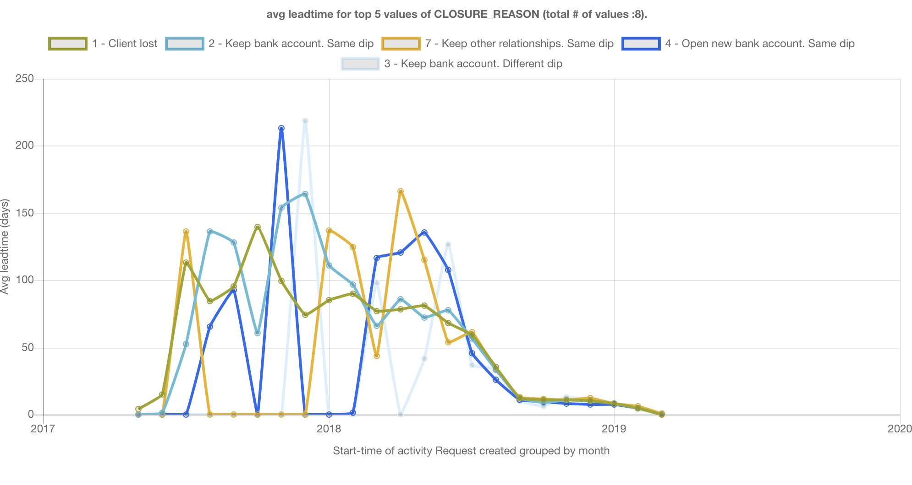

# IBM Process Mining Custom Widgets

## Dimension_linechart
Displays the evolution of the number of cases along the time axis. The cases are split among the values of a dimension. Example: what is the number of cases for each month, according to the 'CLOSURE REASON' dimension.

There is a complete tutorial about developing advanced custom widgets based on this widget: [Tutorial](./dimension_linechart/README.md)

## Dimension_leadtime_LC
Displays the evolution of the average leadtime of cases along the time axis. The cases are split among the values of a dimension. Example: what is the average of cases for each month, according to the 'CLOSURE REASON' dimension.

