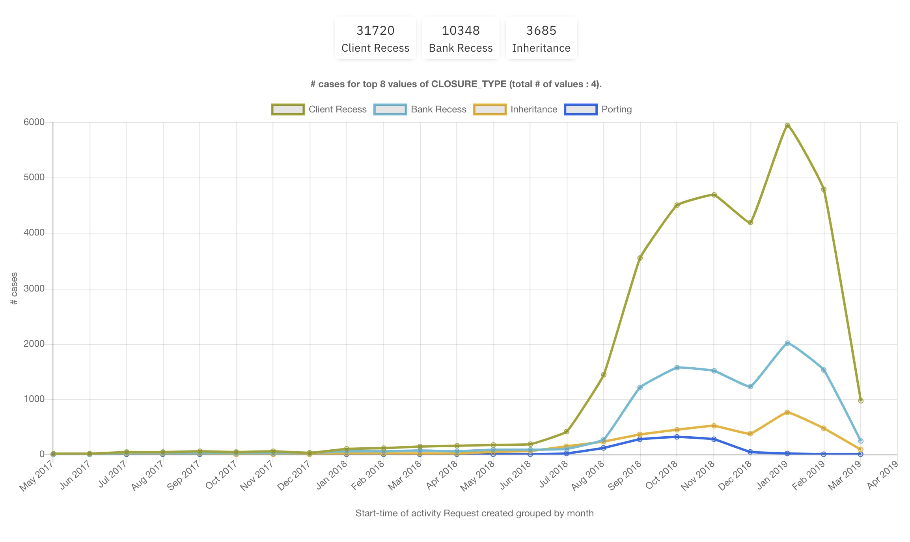
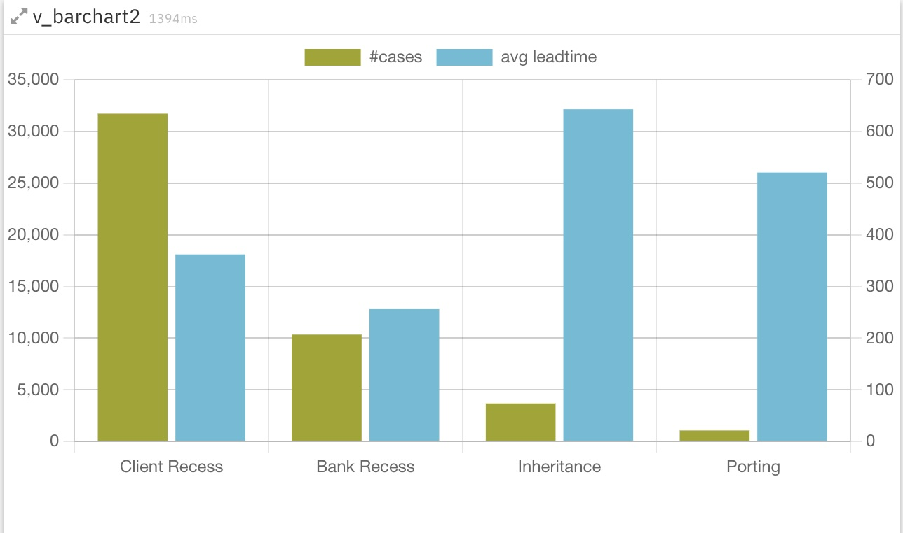
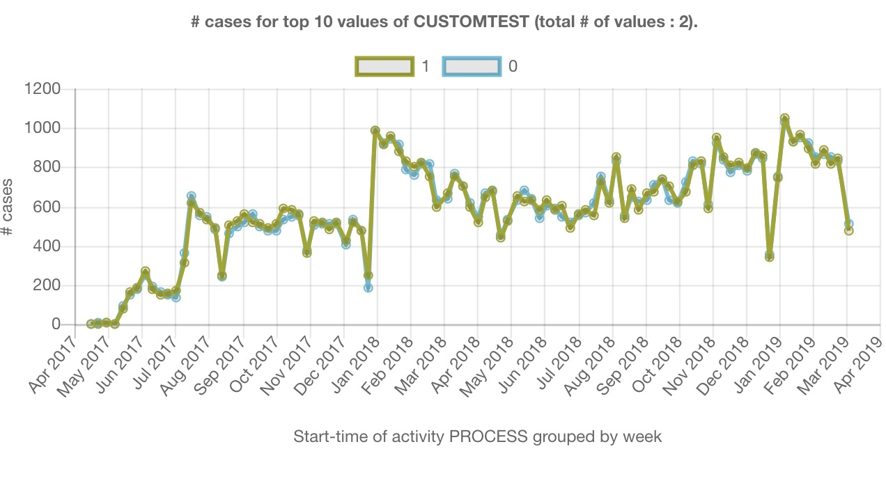

# IBM Process Mining Custom Widgets

## Dimension_linechart
Displays the evolution of the number of cases along the time axis. The cases are split among the values of a dimension. Example: what is the number of cases for each month, according to the 'CLOSURE REASON' dimension.

There is a complete tutorial about developing advanced custom widgets based on this widget: [Tutorial](./dimension_linechart/README.md)

## Dimension_leadtime_LC
Displays the evolution of the average leadtime of cases along the time axis. The cases are split among the values of a dimension. Example: what is the average of cases for each month, according to the 'CLOSURE REASON' dimension.

## v-barchart
Displays different values of a dimension, for each value the # of cases and the average leadtime.

## activity relationships
Displays the relationship between all the activities and the average pathtime. This is a nice complement to the activity relationship view

## Custom Metric Line Chart
Displays a custom metric along time. The timestamp can be chosen like this:
- an activity, then enter STARTTIME or ENDTIME
- a process; then enter PROCESS in the ACTIVITY field

