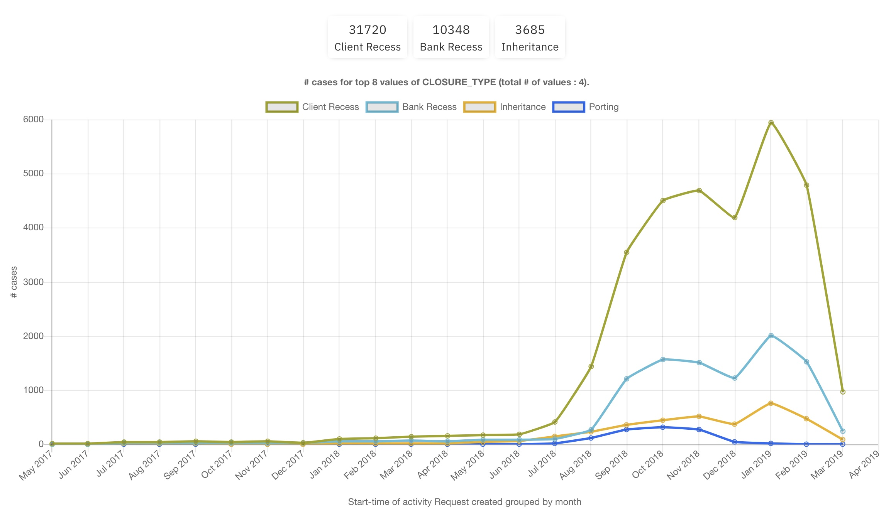
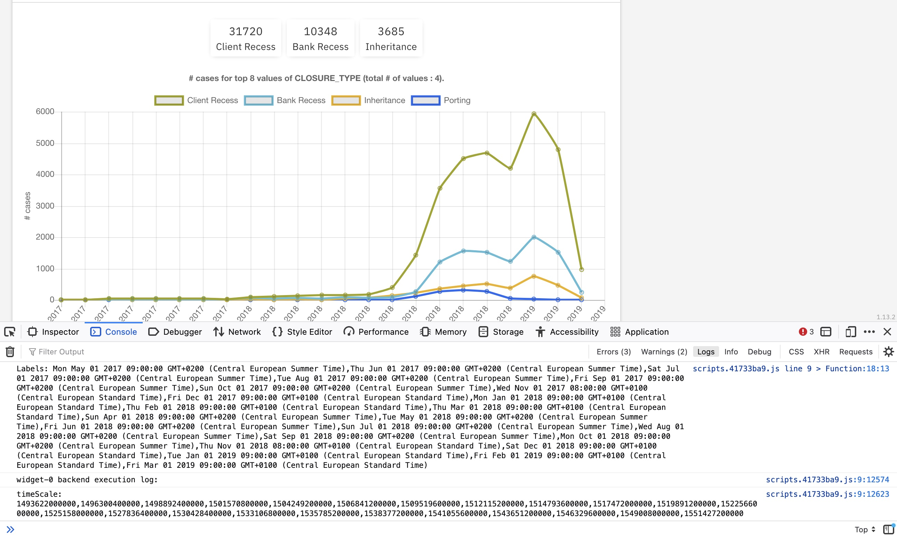

# IBM Process Mining Custom Widget Tutorial - Advanced

This tutorial explains step by step how to create a sophisticated custom widget that displays data with charts.js.

## Why creating a custom widget

The widget enables showing a typical question from clients like: 'I would like to see the evolution of cases according to the dimension 'CLOSURE REASON' for my Banck Account Closure usecase'. This requires displaying each value of 'CLOSURE REASON' as a line chart, projected on a time axis. As you might have noticed already, this is not feasible with the default widgets.



Note that this widget can only be used with the dimensions available through mapping the event log. If you need to display the evolution of custom metrics, you would use the same code, but you would have to compute the metric in the backend of the widget.


## Create a custom widget
Refer to the official documentation: https://www.ibm.com/docs/en/process-mining/1.13.2?topic=analytics-custom-plug-ins

The creation of a custom widget relies on 6 main parts.
- Schema stores the widget parameters
- backend.js parses the cases to create the data that is eventually used to display the widgegt.
- frontend.js transforms the data prepared by backend.js to be displayed in the front-end componants.
- view.html displays the data in the widget
- style.css holds the styling rules


## Dimension Line Chart Schema
This section specifies the parameters used in the widget. For the dimension line chart, we need the following parameters:
- ```DIMENSION``` (dimension): select the event log field for which we want to display the value evolution 
- ```ACTIVITY``` (string): enter the activity that holds the value. Without this information, we would have to always parse all the events, that would result in slower performance.
- ```GROUPBY``` (string): enter how we group the dates. By day, week, month, year
- ```TIME_LABEL_UNIT``` (string): enter the chart X axis label unit. By day, week, month, year
- ```MAX_NUMBER_OF_VALUES_DISPLAYED``` (string): Each value is displayed as a line chart. Limit the number of charts displayed (max: 50)
- ```KEEP_EMPTY_VALUES``` (string): enter 'y' to keep the cases where the value is empty. It will be displayed as a 'None' value. Enter 'n' if these cases are discarded.


## Dimension Line Chart backend.js
When creating a new widget, [backend.js](./backend.js) includes the following code. I added some comments to explain the role of each function.

```javascript
(function(){
return {
	init: function(params) {
        // Called when initiating the widget
        // Retrieve the parameters, create global variables.
    },

	update: function(trace) {
        // Called for all the cases, including those that are excluded by a filter
		if(trace.getDiscarded == 1) { // discard the cases excluded by a filter
			return;
		}
        // Get data from the first or last event of the case, or parse all the events to retrieve an activity and/or the value of a dimension
	},
	
	finalize: function(output) {
        // transmit the data to the front end, through the output object
	}
};})();
```

### Backend data computed from the cases:

For this widget, we want to create two data that will be sent to the front end:
- the X axis time scale: ```timeScale```
- the dataset that holds the count of cases for each value of DIMENSION, for each date of the time scale: ```dataset```.

``` timeScale ``` is an array of dates in milliseconds that depends on the GROUPBY parameter. For example, if GROUPBY is 'month', the time scale starts with the earliest month found in the dataset, and finishes with the latest month found in the dataset. Each month in between is inserted in the array. ``` timeScale ``` is updated by each new case, with the function ```computeScale()```.

``` dataset ``` is an array of objects. Each object stores a DIMENSION value, and an array of counters for each date of the time scale. It looks like this: ``` [{'value':'Client Recess', 'counters':[250, 1256, 2345]}, {'value':'Bank Recess', 'counters':[150, 3000, 6778]}, ... ]```. ``` dataset ``` is updated in the function ```update()```, and each counter array is possibly completed with new dates in ```computeScale()```.


### Backend function summaries:
The following code summarizes what each function in backend.js does. For details, see the code in [backend.js](./backend.js).

``` javascript
(function () {

    function filterAndComputeMetrics(trace) {
        /*
        This function filters the cases and return a series of metrics. 
        In a POC I had to create several widgets with different filters and metrics, that eventually displayed similarly.
        By just changing some lines of code in this function, I could easily create variants.
        */
        var metrics = {
            'exclude': 0,
            'value': 0,
            'eventTime': 0
        };
        for (var k = 0; k < trace.size(); k++) {
            var event = trace.get(k);
            /*
            - Parse each event to search the ACTIVITY set as parameter.
            - Get the value for the DIMENSION selected as parameter
            - Get the start time of the ACTIVITY
            - Exclude the case if ACTIVITY not found
            ...
            */
        }
        return metrics;
    }

    function computeScale(groupBy, aDate) {
        /* 
        - Update timeScale with the ACTIVITY start time.
        - The time scale depends on the GROUPBY parameter (day, week, month, year)
            - The ACTIVITY start time is transformed according to GROUPBY as a day, a week, a month, or a year
            - If this date is not yet within timeScale, add it at the beginning or at the end, as well as each intermediate 'tick'.
            - Update dataset.counters array to add a new entry for each new date in the timeScale.
            - return the transformed start time
        */  
        return eventTime;
    }


    return {
        init: function (params) {
            /*
            - Retrieve the widget parameters, and set default values
            - Add the data needed for the widget:
            */

            var timeScale = [];
            var dataset = [];
        },

        update: function (trace) {

            if (trace.getDiscarded == 1) {
                return;
            }

            var metrics = filterAndComputeMetrics(trace);
            if (metrics.exclude)
                return;

            eventTime = computeScale(GROUPBY, new Date(metrics.eventTime));

            if (dataset.length == 0) { // first event
                dataset.push({ 'value': metrics.value, 'counters': [1] });
                return;
            }

            // search the index of 'value' in the dataset array
            var valueindex = -1;
            for (var k = 0; k < dataset.length; k++) {
                if (dataset[k].value == metrics.value) {
                    valueindex = k;
                    break;
                }
            }
            if (valueindex < 0) {// value not yet added; add it to dataset
                valueindex = dataset.push({ 'value': metrics.value, 'counters': [] }) - 1;
                // update counters
                for (var ii = 0; ii < dataset[0].counters.length; ii++)
                    dataset[valueindex].counters.push(0);
            }
            // update the counters
            dataset[valueindex].counters.[times.indexOf(eventTime)]++;
        },

        finalize: function (output) {
            // Set the data sent to the front end
            output['DIMENSION'] = DIMENSION;
            output['GROUPBY'] = GROUPBY;
            output['TIME_LABEL_UNIT'] = TIME_LABEL_UNIT;
            output['MAX_NUMBER_OF_VALUES_DISPLAYED'] = MAX_NUMBER_OF_VALUES_DISPLAYED;
            output['ACTIVITY'] = ACTIVITY;
            output['timeScale'] = timeScale;
            output['dataset'] = dataset;
        }
    };
})();
```

## frontend.js
The frontend.js code is used to init or create some front end objects - for instance we create the chart; and to transform the backend data into data that is useful to display the widget.

By default, it looks like this:
``` javascript
return {
	init: function(context){
		
	},

	update: function(data, context){

	},

	resize: function(size, context){

	}
};
```
This widget displays the results as a chart. For security reasons, we can't get the charts.js code directly from the charts.js web side. Therefore, we need to include the charts.js code into the widget, in the function ```init()```. That's not very nice, but that's how we can do this for the moment.

The function ```resize()``` is used to adapt the widget to the browser window size. We don't need this here.

The function ```udpate()``` transforms the data from the backend, and creates the linechart.

### frontend.js update() function
We retrieve the backend data in the object ```data```, like ```data.timeScale```, ```data.dataset```, etc. We add these data to the context of the widget with ```context.scope.data = data;```.

The ```data.timeScale``` is the X time scale in milliseconds. The chart requires labels for the X axis, so we need to create a new array ```data.labels``` from the timeScale.
```javascript
    data.labels = [];
    for (var i = 0; i < data.timeScale.length; i++) {
        data.labels.push(new Date(data.timeScale[i]).toString());
    }
```

Since the widget enables limiting the number of values of DIMENSION displayed, we want to keep the top ones, i.e. the values for which the total count of cases are the higher. We first add a 'count' key to each object, and then we sort the dataset using this 'count' key.
```javascript
    for (var i = 0; i < data.dataset.length; i++) {
        data.dataset[i].count = data.dataset[i].counters.reduce((accumulator, currentValue) => accumulator + currentValue);
    }
    data.dataset.sort(function (a, b) {
        return b.count - a.count;
    });
```
Finally, we can create the chartDataset required for the linechart. The chartDataset is an array of objects, each object is charted as a polyline. We create it from the data.dataset fields (value, counters).

```javascript
    data.chartDataset = [];
    var maxchart = Math.min(50, data.MAX_NUMBER_OF_VALUES_DISPLAYED, data.dataset.length);
    for (var i = 0; i < maxchart; i++) {
      data.chartDataset.push({ "data": data.dataset[i].counters, "label": data.dataset[i].value, "borderColor": colorPalette[i], "tension": 0.1, "fill": false });
    }
```
At this point, we can create the charts.js linechart. Notice that the chart is created in a canvas named 'dimensions_LC'. This frame is created in view.html. This name is hardcoded in view.html, and we did not find a way to parametrize it. Therefore we can only have one widget in each dashboard.

```javascript
    new Chart(document.getElementById('dimensions_LC'), {
      type: 'line',
      data: {
        labels: data.labels,
        datasets: data.chartDataset
      },
        ...
```

## view.html
[view.html](./view.html) includes the html code of the widget.

First, we display 3 KPIS: the total number of cases for the 3 values that are the most often used. We are using styling classes defined in style.css (see below). Note that we are limiting each value string to the first 10 characters.

Then we define the canvas that is being used by the chart object in frontend.js

```html
<div>
    <div class="main-grid">
        <div class="kyp-wrapper">
            <div class="kpi-card">
                <h1>
                    {{data.dataset[0].count}}
                </h1>
                <p>
                    {{data.dataset[0].value.slice(0,10)}}
                </p>
            </div>

            <div class="kpi-card">
                <h1>
                    {{data.dataset[1].count}}
                </h1>
                <p>
                    {{data.dataset[1].value.slice(0,10)}}
                </p>
            </div>

            <div class="kpi-card">
                <h1>
                    {{data.dataset[2].count}}
                </h1>
                <p>
                    {{data.dataset[2].value.slice(0,10)}}
                </p>
            </div>
        </div>
        <canvas id="dimensions_LC"></canvas>
    </div>
</div>
```

## style.css
[style.css](./style.css) includes the style directives that are used for the KPIs. These KPIs show the number of cases for the top 3 most used values of DIMENSIONS. 

## Debugging tactics
Debugging custom widgets can be a challenge, in particular for backend.js. frontend.js code can be more easily debugged using the browsers's web developer tools.

A few tips that helps diagnosing the problem:
- The 'refresh wheel' stops rapidly and the widget displays nothing: Most likely, there is an error with the backend code.
- The widget displays the refresh time in ms, the refresh wheel loops: Most likely, there is an error with the frontend code.

Favor making just a few changes in the code, and test the widget to make sure it still works.

Naturally, I often refactored the widget and made important changes. Unfortunately, a little error can keep you busy for a long time: commenting parts to find the guilty line, and testing again and again.

### Logging messages
You can use ```console.log()``` in both the backend and the frontend code to understand where exception occurs. 

For example, if we are unsure that the time scale is correct, you can display it with ```console.log("timeScale = " + timeScale)``` in the backend code. Similarly, you can display the time labels that are computed in the frontend code: ```console.log(data.labels)```.

You need to use the developer tools of the browser to see the console messages. There is a specific area for backend console logs at the bottom of the console. 

The frontend console logs appear as usual, and you can also add breakpoints and so forth.

In the screenshot below, the frontend message is the first array[23] that contains the time labels. 

At the bottom, you see the 'widget-0 backend execution log:' that shows timeScale. If there are several widgets, there would be one such area for each.



For the backend, using console.log() is nice but not enough in many situations. 


### Debugging from your Development Environment
After having fought against bug desperately, I decided to mimic the backend code in Visual Studio Code, such that I could run and debug the code. If you have complex backend code, I encourage you to apply the same technique. This is applied in the file [debugbackend.js](./debugbackend.js).

The principle is simple:
- The backend data results from analysing the cases in ```filterAndComputeMetrics()```. We copy this function and rename it ```filterAndComputeMetrics_emulate()```. Instead of using cases, we generate the values and the start-time, and we return the metrics.
```javascript
function filterAndComputeMetrics_emulate(trace) {
    var values = ['a', 'b', 'c', 'd', 'e', 'f'];
    var metrics = {
        'exclude': 0,
        'value': 0,
        'eventTime': 0
    };
    // emulate event.getStartTime()
    datePeriod.fromTime = new Date(datePeriod.fromDate).getTime();
    datePeriod.duration = new Date(datePeriod.toDate).getTime() - datePeriod.fromTime;
    metrics.eventTime = datePeriod.fromTime + Math.floor(Math.random() * datePeriod.duration);

    // emulate event.getStringCustomAttributeValue(DIMENSION);
    metrics.value = values[Math.floor(Math.random() * values.length)];

    return metrics;
}
```
- We copy the ```update()``` function that computes the dataset, and we replace ```filterAndComputeMetrics()``` by ```filterAndComputeMetrics_emulate()```.
- We copy the ```updateScale()``` function that updates the timeScale.
- Then we can emulate the cases with a for loop, and we can display and check the results.

In Visual Studio Code, you can run the program and use the debugger to add breakpoints and to check variables.


When you are happy with the debugbackend.js code, you can even copy filterAndComputeMetrics_emulate() in backend.js, and call filterAndComputeMetrics_emulate() from update(), such that you are sure of the data when developing/debugging the front-end.

When the front-end works as required, you call the original filterAndComputeMetrics() function that gets the data from the cases.

## Conclusion
There is as similar widget that displays the evolution of the average leadtime for each value of DIMENSION. You will see how it derives from the code we have explained: [../dimension_leadtime_LC](../dimension_leadtime_LC)


