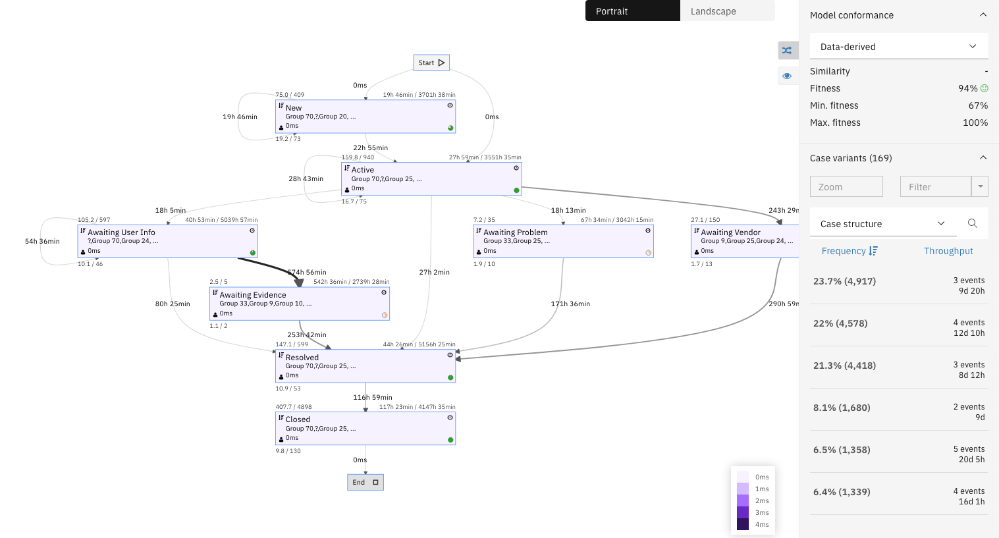
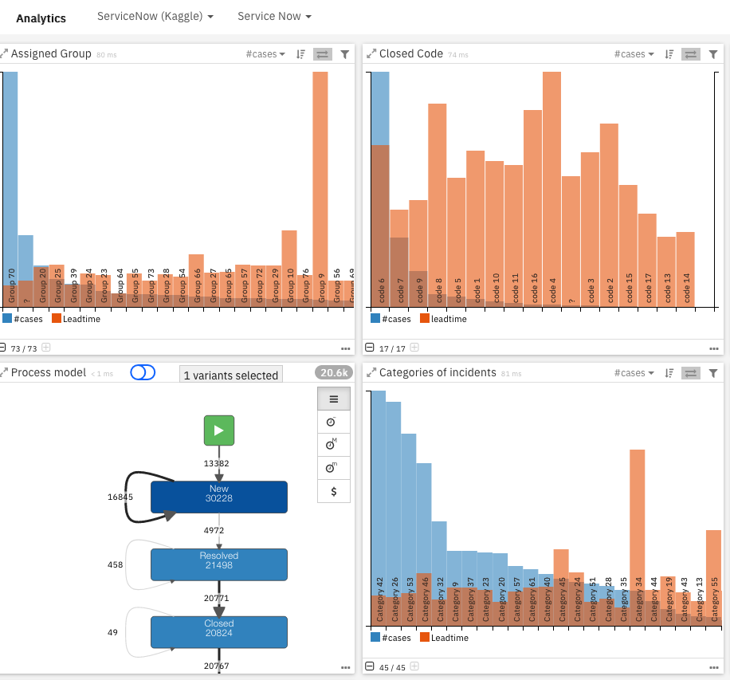

# Service Now - Kaggle dataset
This Service Now dataset is from Kaggle https://www.kaggle.com/vipulshinde/incident-response-log?select=incident_event_log.csv

The dataset and IDP files in this github repo can be used as is. Unzip the ZIP file first.
- We mapped most the fields without transforming the initial dataset to obtain directly this process map

- We created a dedicated dashboard, that can be used as a sample for dashboard creation.

