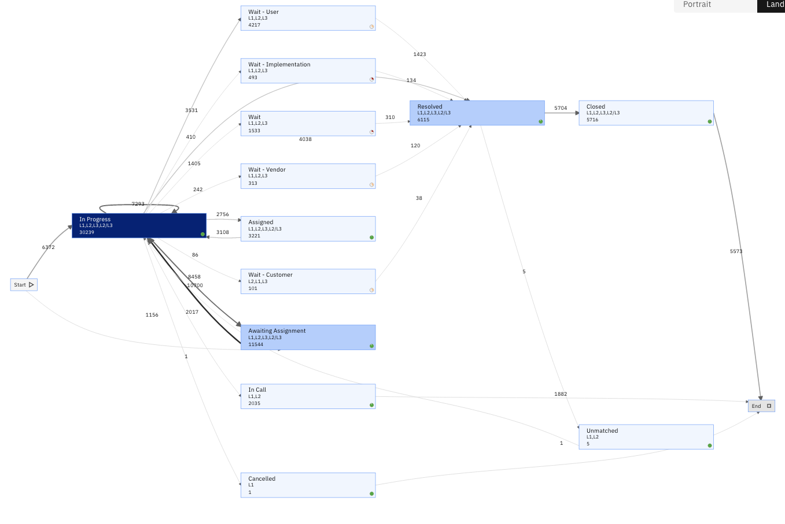
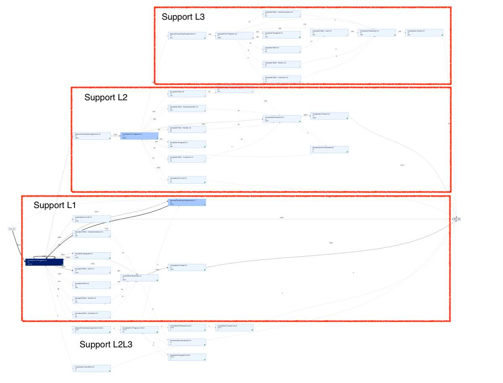

# Volvo IT - Business Process Intelligence 2013 Challenge
This Volvo IT use case is from Business Process Intelligence challenge 2013. It is a typical support ticketing process.

Read the problem description from [BPI 2013](https://www.win.tue.nl/bpi/doku.php?id=2013:challenge&redirect=1id=2013/challenge).
You can get the original dataset from [here](https://www.win.tue.nl/bpi/lib/exe/fetch.php?media=2013:csv_files.zip), but we transformed it a bit to provide better insights.

The dataset and IDP files in this github repo can be used as is.
We describe below the steps we took to answer the business questions.

## Data Transformation
Why we transformed the original dataset (using Excel):
* The relevant information about the activities is in 2 columns Status and sub status. We merged these columns
* The relevant information about support level (1, 2, 3) is contained into the Involved ST column (ex V5 3rd). We created 2 new columns:  one for the Support service (ex V5) and another column for the support level.
* To obtain a clearer picture of how tickets flow within Level 1, 2, and 3, we combine the activity name and the support level. This way the sequence clearly shows where/how each level is involved
* The Owner First Name is not unique, I merged the owner and the country to create a unique resource name.

## Process mining and mapping choices
We can choose which column we map to 'business activity'. If we map the original column that does not distinguish between the support level, it is difficult to visualize the push to front strategy.



When we map the business activity to the new field that combines the task and the support level, we see more clearly the transitions between support levels. 



## Push To Front Strategy
We created several filters to highlight the cases that follow the Push to Front strategy, and to reveal the cases where support 'play ping pong'. We illustrated the creation of filters using the UI and Scripts.

Tickets should always follow this path: 
- L1
- L1->L2
- L1->L2->L3

The support policy does not allow for L2 or L3 to start a ticket, nor to miss a level, nor to go down from a higher level to a lower one.


### Combining filters
By combining a series of individual filters (see Compliant PushToFront saved template). Note that when adding filters, the logical operation is AND. By ANDing these exclusion filters, we are ORing their negation, ie we obtain the compliant cases. The exclusion filters are:
```
- Exclude cases that start with a L2 role
- Exclude cases that start with a L3 role
- Exclude cases that start with a L2L3 role
- Exclude cases that contain a sequence <L2>*<L1> (going backward)
- Exclude cases that contain a sequence <L3>*<L1> (going backward)
- Exclude cases that contain a sequence <L3>*<L2> (going backward)
```

### Using JavaScript to create filters
Using JavaSript, one can create powerful filters. A trace is a case (or a process) from which we can get all the events and their properties.

In this example, we want to keep the non-conformant cases, ie the cases that do not start with L1 support level, or that are going backward (ex from L3 to L2).
```javascript
var filter = {
      keepTrace: function(trace) {
      var event = trace.get(0);
      // exclude cases that start with L1
      if (event.getRole() !== 'L1') return true;
       var currentRole, previousRole;
      for(var k = 1 ; k < trace.size(); k++) {
        event = trace.get(k);
        previousRole = currentRole;
        currentRole = event.getRole();
        var sequence = previousRole + currentRole;
        switch(sequence){
            case 'L2L1': return true;
            case 'L3L2': return true;
            case 'L3L1': return true;
            case 'L1L3': return true;
        }
      }
      return false;
   }
};
```
